# こんにちは！kume です 👋

**金沢工業大学 情報工学科**　|　ものづくりが好きなエンジニア志望

---

## 🙋 About

金沢工業大学 情報工学科。Web・モバイル・デスクトップ・CLI と幅広く開発。  
現在は **Kotlin（Android）** と **TypeScript** を重点的に学習中。

**Languages:**

  

**Tools:**

  

---

## 🚀 制作物

> 📝 **掲載リポジトリのドキュメント（README・技術仕様書）はすべて私が執筆しています。**

---

## 🏆 ハッカソン

#### [4DX@HOME](https://github.com/jphacks/kz_2504) — JPHacks 2025

**AI動画解析による家庭用4DXシステム。** 任意のMP4動画をGemini 2.5 Pro Visionで解析し、振動・光・風・水・色の5種類の物理フィードバックを自動生成。  
Webアプリ（React + TypeScript） × Cloud Run API（FastAPI） × Raspberry Pi Hub × ESP-12E × 4台の3層アーキテクチャ。  
映像と物理効果の同期誤差は **±100ms以内**。3Dプリント筐体も自作。

> 🔗 [Live Demo](https://kz-2504.onrender.com)

>      

> 📝 **README・技術仕様書（5種）を執筆**

---

#### [Sleep Buster (WILDCARD)](https://github.com/Saisei2004/WILDCARD) — Hackit 2025

**みんなの朝を「つなぐ」アラームアプリ。** 友達が遠隔操作でロボット「バスタ君」（LEGO EV3製）を動かし、寝坊した人を**物理的に**たたき起こす。  
SkyWay WebRTCによるリアルタイム映像確認、Firebase経由の起床ステータス同期、Bluetooth制御を実装。  
8チームが参加する学内ハッカソン「Hackit 2025」で **最優秀賞を受賞**。

>     

> 📝 **README・システム仕様書（全15章）を執筆**

---

#### [EnCounter](https://github.com/razy6174/EnCounter) — スマプロハッカソン 2026

**ハイパーローカル・すれちがいマッチングアプリ。** BLE（Bluetooth Low Energy）で半径数メートル以内の「すれ違い」をリアルタイム検知し、気分(Mood)と興味タグが一致した時だけマッチング通知。  
位置情報不要・匿名認証・ステルスモード搭載。チャット、すれちがい図鑑、鼓動風バイブレーション通知を実装。  
担当：**バックエンド / アーキテクチャ設計 / BLE通信 / Firebase連携**。

>      

> 📝 **README・バックエンド仕様書・フロントエンド仕様書を執筆**

---

### 🌐 個人開発 & Chrome 拡張

| プロジェクト | 概要 | 技術 |
|---|---|---|
| [**ポートフォリオサイト**](https://github.com/Soki0909/Soki0909.github.io) | 自作ポートフォリオサイト ([公開中](https://soki0909.github.io/)) |  |
| [**happy-chicken-ticket-system**](https://github.com/Soki0909/happy-chicken-ticket-system) | 工大祭屋台で使用したQRコードベースのリアルタイム整理番号管理システム |  |
| [**pdf_to_markdown**](https://github.com/Soki0909/pdf_to_markdown) | PDFをMarkdown形式に変換するCLIツール |  |
| [**PianoApp**](https://github.com/Soki0909/PianoApp) | OpenGLで制作した3D電子ピアノ |  |
| [**subject_semester_sorter**](https://github.com/Soki0909/subject_semester_sorter) | KITナビ上で年度・学期の履修科目を一覧表示（Chrome拡張） |  |
| [**kit_navi_autofocus**](https://github.com/Soki0909/kit_navi_autofocus) | 大学ポータルのログイン・ナビ操作を自動化（Chrome拡張） |  |
| [**think_before_ai**](https://github.com/Soki0909/think_before_ai) | 生成AIサイトを開く前に「本当に必要？」と問いかけるポップアップ（Chrome拡張） |  |

---

## 📊 GitHub 統計

---

**訪問ありがとうございます！** 気になるリポジトリがあれば ⭐ をもらえると嬉しいです 😊

